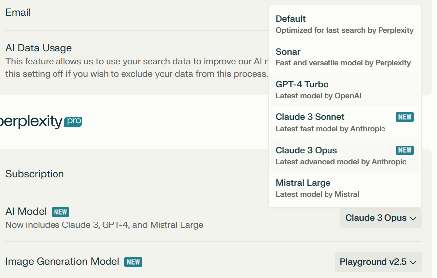

# perplexity pro 申请方法

 

## 1.生成卡片

[Random Credit Card Number Generator for Testing and Development - Namsogen (namso-gen.com)](https://namso-gen.com/?tab=advance&network=MasterCard)

绑卡网站 使用 𝗕𝗜𝗡: 601121255660xxxx 10|2026 去生成

## 2.检测卡片是否存活

再将生成的 bin 复制到下面的网址检测卡片是否存活

[CC Checker - Free credit card checker Mrchecker.net 140](https://www.mrchecker.net/card-checker/ccn2/)

## 3.创建一个临时邮箱

[https://mail.tm/zh](https://mail.tm/zh)

## 4.美国地址生成器

[美国地址生成器 - 美国身份生成器 - 美国信用卡生成器 (meiguodizhi.com)](https://www.meiguodizhi.com/)

## 5.官网地址  
[https://www.perplexity.ai/](https://www.perplexity.ai/)  邀请码CRNT018

## 6.模型介绍

