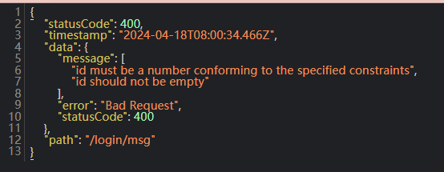

# NestJS DTO管道验证

## 安装验证器

```bash
npm install class-validator class-transformer

```

## 使用管道验证

需要新增一个DTO文件，用于验证数据

```ts
// check.dto.ts
import { IsNotEmpty, IsNumber } from 'class-validator';

export class checkDTo {
  @IsNotEmpty()
  @IsNumber()
  id: number;
}

```

## 注册全局DTO验证管道
  
```ts
// main.ts
import { ValidationPipe } from '@nestjs/common';
async function bootstrap() {
  const app = await NestFactory.create(AppModule);
  app.useGlobalPipes(new ValidationPipe());
  await app.listen(3000);
}
```

## 验证结果

请求<http://localhost:3000/login/msg>

