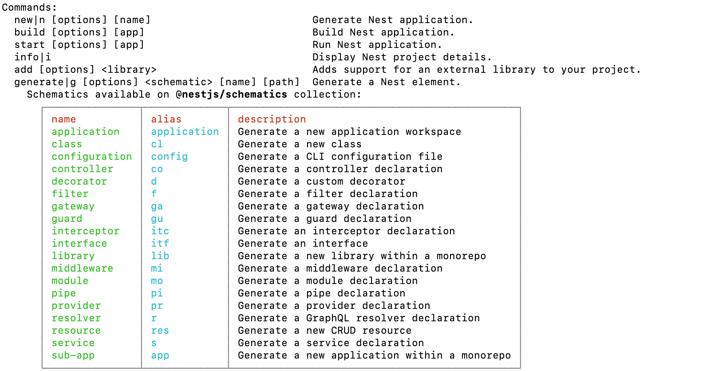

# 通过cli创建nestjs项目

``` js
npm i -g @nestjs/cli  // 安装cli
nest new [项目名称]

```

## 启动项目 我们需要热更新 就启动npm run start:dev就可以了

``` js
  "start": "nest start",
    "start:dev": "nest start --watch",
    "start:debug": "nest start --debug --watch",
    "start:prod": "node dist/main",
```

## 创建一个模块

使用nest --help可以查看所有的命令 并且查看有哪些模块


``` js
nest g module [模块名称]
```

## 配置静态文件

首先安装第三方模块

``` js
pnpm install @nestjs/platform-express

```

在main.ts中配置

``` ts
import { NestExpressApplication } from '@nestjs/platform-express';
const app = await NestFactory.create<NestExpressApplication>(AppModule);
import * as path from 'path';
// 配置静态文件夹目录
  app.useStaticAssets('public',{ prefix: '/public' }); // 访问路径为http://localhost:3000/public/index.html
  app.useStaticAssets(path.join(__dirname, '..', 'public')); // 访问路径为http://localhost:3000/index.html 使用相对路径


```
