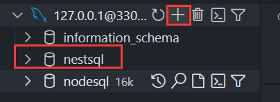

# ORM框架（typeOrm）

## 安装需要的依赖 以及插件

### 安装typeorm

``` sh
pnpm install --save @nestjs/typeorm typeorm mysql2
```

### 安装数据库可视化插件

1.vscode安装数据库可视化插件Database Client

2.使用Database Client插件连接数据库 并使用 右上角的+号添加新的数据库


## 配置数据库连接

在app.module.ts 注册

``` ts

//app.module.ts
import { TypeOrmModule } from '@nestjs/typeorm';

 @Module({
  imports: [
    LoginModule,
    UploadModule,
    TypeOrmModule.forRoot({
      type: 'mysql', //数据库类型
      username: 'root', //账号
      password: '800896688d', //密码
      host: 'localhost', //host
      port: 3306, //
      database: 'nestSql', //库名
      //entities: [__dirname + '/**/*.entity{.ts,.js}'], //实体文件
      synchronize: true, //synchronize字段代表是否自动将实体类同步到数据库  生产环境不建议使用
      retryDelay: 500, //重试连接数据库间隔
      retryAttempts: 10, //重试连接数据库的次数
      autoLoadEntities: true, //如果为true,将自动加载实体 forFeature()方法注册的每个实体都将自动添加到配置对象的实体数组中
    }),
  ],
  controllers: [AppController], // 路由
  providers: [AppService], // 服务
})
```

## 配置实体类

``` ts
//user.entity.ts
import {Entity,Column,PrimaryGeneratedColumn} from 'typeorm'
import { Column, Entity, PrimaryGeneratedColumn } from 'typeorm';
@Entity()
export class Login {
  @PrimaryGeneratedColumn() // 主键
  id: number;
  @Column() // 字段
  username: string;
  @Column() // 字段
  password: string;
}
```

## 关联实体类

`TypeOrmModule.forFeature([Guard])`

```ts
//login.module.ts
// 引入TypeOrmModule的作用是为了使用forFeature方法 forFeature方法接收一个实体类数组 用于注册实体类
import { TypeOrmModule } from '@nestjs/typeorm'; 
// 引入实体类 用于注册实体类
import { Login } from './login.entity';
@Module({
  imports: [TypeOrmModule.forFeature([Login])],
  controllers: [LoginController],
  providers: [LoginService],
})

```

## 实体类中属性的装饰器

``` ts
    @Column({
        type:"varchar", //列的数据类型
        name:"ipaaa", //数据库表中的列名
        nullable:true, //在数据库中使列NULL或NOT NULL。 默认情况下，列是nullable：false
        comment:"注释",
        select:true,  //定义在进行查询时是否默认隐藏此列。 设置为false时，列数据不会显示标准查询。 默认情况下，列是select：true // 仅在查询中选择此列
        default:"xxxx", //加数据库级列的DEFAULT值
        primary:false, //将列标记为主要列。 使用方式和@ PrimaryColumn相同。
        update:true, //指示"save"操作是否更新列值。如果为false，则只能在第一次插入对象时编写该值。 默认值为"true"
        collation:"", //定义列排序规则。
    })

```

ColumnOptions中可用选项列表：

- type: ColumnType - 列类型。其中之一在上面.
- name: string - 数据库表中的列名。 默认情况下，列名称是从属性的名称生成的。 你也可以通过指定自己的名称来更改它。
- length: number - 列类型的长度。 例如，如果要创建varchar（150）类型，请指定列类型和长度选项。
- width: number - 列类型的显示范围。 仅用于MySQL integer types(opens new window)
- onUpdate: string - ON UPDATE触发器。 仅用于 MySQL (opens new window).
- nullable: boolean - 在数据库中使列NULL或NOT NULL。 默认情况下，列是nullable：false。
- update: boolean - 指示"save"操作是否更新列值。如果为false，则只能在第一次插入对象时编写该值。 默认值为"true"。
- select: boolean - 定义在进行查询时是否默认隐藏此列。 设置为false时，列数据不会显示标准查询。 默认情况下，列是 select：true // 仅在查询中选择此列。

- default: string - 添加数据库级列的DEFAULT值。
- primary: boolean - 将列标记为主要列。 使用方式和@ PrimaryColumn相同。
- unique: boolean - 将列标记为唯一列（创建唯一约束）。
- comment: string - 数据库列备注，并非所有数据库类型都支持。
- precision: number - 十进制（精确数字）列的精度（仅适用于十进制列），这是为值存储的最大位数。仅用于某些列类型。
- scale: number - 十进制（精确数字）列的比例（仅适用于十进制列），表示小数点右侧的位数，且不得大于精度。 仅用于某些列类型。
- zerofill: boolean - 将ZEROFILL属性设置为数字列。 仅在 MySQL 中使用。 如果是true，MySQL 会自动将UNSIGNED属性添加到此列。
- unsigned: boolean - 将UNSIGNED属性设置为数字列。 仅在 MySQL 中使用。
- charset: string - 定义列字符集。 并非所有数据库类型都支持。
- collation: string - 定义列排序规则。
- enum: string[]|AnyEnum - 在enum列类型中使用，以指定允许的枚举值列表。 你也可以指定数组或指定枚举类。
- asExpression: string - 生成的列表达式。 仅在MySQL (opens new window)中使用。
- generatedType: "VIRTUAL"|"STORED" - 生成的列类型。 仅在MySQL (opens new window)中使用。
- hstoreType: "object"|"string" -返回HSTORE列类型。 以字符串或对象的形式返回值。 仅在Postgres中使用。
- array: boolean - 用于可以是数组的 postgres 列类型（例如 int []）
- transformer: { from(value: DatabaseType): EntityType, to(value: EntityType): DatabaseType }- 用于将任意类型- EntityType的属性编组为数据库支持的类型DatabaseType。
